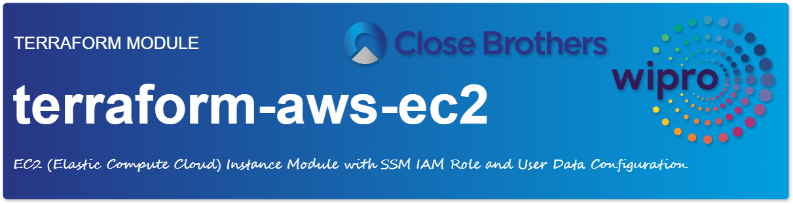

<a href=""></a><br/>
# EC2 Instance Module with SSM IAM Role and User Data Configuration

This Terraform module manages the creation of an EC2 instance with flexible configurations, including an optional SSM IAM role and custom user data capabilities. The module allows for dynamic management of default and custom user data scripts, and attaches an IAM role for Systems Manager (SSM) access if needed.

## Features

- [X] **EC2 Instance Creation**: Launches an EC2 instance with custom instance settings.
- [X] **SSM IAM Role**: The module automatically creates an IAM role and instance profile for SSM access if one does not already exist. This allows you to manage the instance using Systems Manager.
- [X] **Default User Data Script**: The module includes a default user data script that performs basic instance initialization tasks. You can also provide your own custom user data scripts.
- [X] **User Data Customization**: Merges a default startup script with user-provided user data.
- [X] **Custom Tagging and Configurations**: Supports custom tags, AMI lookup by region, and other instance properties.

## Usage

### Example `main.tf`

```hcl
module "ec2_instance" {
  source = "./path/to/module" # "git::https://gitlab.com/......?ref=v1.0.0"

  name                            = "cbpf-p-euw1-az1-ec2-demo-001"  
  environment                     = "dev"
  region                          = "us-east-1"
  enable_instance                 = true
  instance_ami                    = "ami-0c55b159cbfafe1f0" # Example AMI ID
  instance_type                   = "t2.micro"
  instance_vpc_security_group_ids = ["sg-0a1b2c3d4e5f6g7h8"]
  instance_subnet_id              = "subnet-0123456789abcdef0"
  instance_user_data              = <<-EOF
    #!/bin/bash
    echo "User-specific script running..."
    # additional commands
  EOF
  tags = {
    Project       = "demo"
  }
}
```
</br>

### Simple EC2 Instance Example
This example demonstrates a basic EC2 instance setup with minimal configuration. It launches a `t2.micro` instance in the specified subnet and security group, using a predefined AMI.

```hcl
module "simple_ec2" {
  source = "./modules/ec2-instance"

  instance_name = "my-simple-instance"
  environment   = "dev"
  region        = "us-east-1"

  instance_ami                    = "ami-0c55b31ad2299a701" # Replace with your desired AMI
  instance_type                   = "t2.micro"
  instance_vpc_security_group_ids = ["sg-0a1b2c3d4e5f6g7h8"] # Replace with your security group ID
  instance_subnet_id              = "subnet-0123456789abcdef0" # Replace with your subnet ID

  tags = {
    Project = "simple-ec2"
  }
}

```
</br>

### Complex EC2 Instance Example
This example showcases a more advanced configuration with custom user data, EBS volumes, and a dedicated IAM instance profile.

```hcl
module "complex_ec2" {
  source = "./modules/ec2-instance"

  instance_name = "my-complex-instance"
  environment   = "prod"
  region        = "us-west-2"

  instance_ami                    = "ami-0a1b2c3d4e5f6g7h8" # Replace with your desired AMI
  instance_type                   = "t3.medium"
  instance_vpc_security_group_ids = ["sg-9876f5e4d3c2b1a0"] # Replace with your security group ID
  instance_subnet_id              = "subnet-0fedcba987654321" # Replace with your subnet ID

  # Custom user data script
  instance_user_data = <<-EOF
    #!/bin/bash
    echo "Installing Apache..."
    sudo yum install -y httpd
    sudo systemctl enable httpd
    sudo systemctl start httpd
  EOF

  # EBS volume configuration
  instance_root_block_device = [
    {
      volume_size = 50
      volume_type = "gp3"
    }
  ]
  instance_ebs_block_device = [
    {
      device_name           = "/dev/sdb"
      volume_size           = 100
      volume_type           = "gp3"
      delete_on_termination = true
    }
  ]

  # Dedicated IAM instance profile
  instance_iam_instance_profile = "my-custom-instance-profile" # Replace with your instance profile name

  tags = {
    Project = "complex-ec2"
  }
}

```
Explanation:

- **Simple Example**: This example focuses on the essential parameters for launching a basic EC2 instance.
- **Complex Example**: This example demonstrates additional features:
  - **Custom User Data**: A script is provided to install and start Apache on the instance.
  - **EBS Volumes**: The root volume is configured with a specific size and type, and an additional EBS volume is attached.
  - **IAM Instance Profile**: A dedicated IAM instance profile is attached to the instance, allowing it to assume specific roles and permissions.

Remember to replace the placeholder values (AMI ID, security group ID, subnet ID, instance profile name) with your actual values.


## Components

### Data Sources
- `aws_iam_policy.AmazonSSMManagedInstanceCore`
- `aws_iam_role.ssm_ec2_role`
- `template_file.default_userdata`

### Resources
- `aws_eip.nat_eip`
- `aws_iam_instance_profile.ssm_role_profile`
- `aws_iam_role.ssm_ec2_role`
- `aws_iam_role_policy_attachment.ssm_policy_attach`
- `aws_instance.complex_networking`
- `aws_instance.ebs_keypair`
- `aws_instance.encrypted_userdata`
- `aws_instance.instance`
- `aws_instance.kms_encrypted`
- `aws_instance.main_instance`
- `aws_instance.simple`
- `aws_kms_key.ebs_key`
- `aws_kms_key.example`
- `aws_nat_gateway.nat`
- `aws_security_group.example`
- `aws_security_group.instance_sg`
- `aws_subnet.main_subnet`
- `aws_vpc.main_vpc`

### Local Variables


### Variables

| Variable | Description | Type | Default | Required |
|----------|-------------|------|---------|----------|
| `region` | The region where to deploy this code (e.g. us-east-1). | map(string) | "us-east-1" | No |
| `ami` | Default AMIs by region | map(string) | <pre>{<br/>    us-east-1 = "ami-46c1b650"<br/>    us-west-2 = "ami-50d1d929"<br/>    eu-west-1 = "ami-6e28b517"<br/>  }<br/></pre> | No |
| `environment` | Environment for service | map(string) | "STAGE" | No |
| `tags` | A list of tag blocks. Each element should have keys named key, value, and propagate_at_launch. | map(string) | {} | No |
| `instance_name` | Name to be used on all resources as prefix | bool | "TEST" | No |
| `enable_instance` | Enable instance usage | bool | true | No |
| `instance_ami` | Set AMI ID for AWS EC2 instance | any | "" | No |
| `instance_launch_template` | is specified and the Launch Template specifies an instance type. If an instance type is specified in the Launch Template, setting instance_type will override the instance type specified in the Launch Template. Updates to this field will trigger a stop/start of the EC2 instance. | any | {} | No |
| `instance_metadata_options` | (Optional) Customize the metadata options of the instance | any | {} | No |
| `instance_availability_zone` | (Optional) The AZ to start the instance in. | any | "t2.micro" | No |
| `instance_type` | Type of instance t2.micro, m1.xlarge, c1.medium etc | any | "t2.micro" | No |
| `instance_disk_size` | disk size for EC2 instance | any | 8 | No |
| `instance_tenancy` | (Optional) The tenancy of the instance (if the instance is running in a VPC). An instance with a tenancy of dedicated runs on single-tenant hardware. The host tenancy is not supported for the import-instance command. Available values: default, dedicated, host. | any | "default" | No |
| `instance_host_id` | (Optional) The Id of a dedicated host that the instance will be assigned to. Use when an instance is to be launched on a specific dedicated host. | any | {} | No |
| `instance_cpu_options` | Defines CPU options to apply to the instance at launch time. | any | {} | No |
| `instance_ebs_optimized` | (Optional) If true, the launched EC2 instance will be EBS-optimized. Note that if this is not set on an instance type that is optimized by default then this will show as disabled but if the instance type is optimized by default then there is no need to set this and there is no effect to disabling it. See the EBS Optimized section of the AWS User Guide for more information. If true, the launched EC2 instance will be EBS-optimized | map(string) | [] | No |
| `instance_disable_api_termination` | (Optional) If true, enables EC2 Instance Termination Protection | map(string) | [] | No |
| `instance_initiated_shutdown_behavior` | (Optional) Shutdown behavior for the instance. Amazon defaults this to stop for EBS-backed instances and terminate for instance-store instances. Cannot be set on instance-store instances. See Shutdown Behavior for more information. | map(string) | [] | No |
| `instance_key_name` | (Optional) The key name of the instance | map(string) | [] | No |
| `instance_get_password_data` | (Optional) If true, wait for password data to become available and retrieve it. Useful for getting the administrator password for instances running Microsoft Windows. The password data is exported to the password_data attribute. See GetPasswordData for more information. | map(string) | [] | No |
| `instance_security_groups` | (Optional, EC2-Classic and default VPC only) A list of security group names (EC2-Classic) or IDs (default VPC) to associate with. | map(string) | [] | No |
| `instance_associate_public_ip_address` | (Optional) Associate a public ip address with an instance in a VPC. | map(string) | true | No |
| `instance_source_dest_check` | (Optional) Controls if traffic is routed to the instance when the destination address does not match the instance. Used for NAT or VPNs. Defaults true. | map(string) | true | No |
| `instance_subnet_id` | (Optional) The VPC Subnet ID to launch in. | map(string) | [] | No |
| `instance_vpc_security_group_ids` | The associated security groups in non-default VPC | map(string) | [] | No |
| `instance_monitoring` | (Optional) If true, the launched EC2 instance will have detailed monitoring enabled. If true, the launched EC2 instance will have detailed monitoring enabled | map(string) | {} | No |
| `instance_user_data` | (Optional) The user data to provide when launching the instance. Do not pass gzip-compressed data via this argument; see user_data_base64 instead. | map(string) | {} | No |
| `instance_user_data_base64` | (Optional) Can be used instead of user_data to pass base64-encoded binary data directly. Use this instead of user_data whenever the value is not a valid UTF-8 string. For example, gzip-encoded user data must be base64-encoded and passed via this argument to avoid corruption. | map(string) | {} | No |
| `instance_user_data_replace_on_change` | (Optional) When used in combination with user_data or user_data_base64 will trigger a destroy and recreate when set to true. Defaults to false if not set. | map(string) | {} | No |
| `instance_iam_instance_profile` | (Optional) The IAM Instance Profile to launch the instance with. Specified as the name of the Instance Profile. Ensure your credentials have the correct permission to assign the instance profile according to the EC2 documentation, notably iam:PassRole. | map(string) | {} | No |
| `instance_placement_group` | (Optional) The Placement Group to start the instance in. | map(string) | {} | No |
| `instance_placement_partition_number` | (Optional) The number of the partition the instance is in. Valid only if the aws_placement_group resource's strategy argument is set to 'partition'. | map(string) | {} | No |
| `instance_private_ip` | (Optional) Private IP address to associate with the instance in a VPC. | map(string) | {} | No |
| `instance_ipv6_address_count` | (Optional) A number of IPv6 addresses to associate with the primary network interface. Amazon EC2 chooses the IPv6 addresses from the range of your subnet. | map(string) | {} | No |
| `instance_ipv6_addresses` | (Optional) Specify one or more IPv6 addresses from the range of the subnet to associate with the primary network interface | map(string) | {} | No |
| `instance_volume_tags` | A mapping of tags to assign to the devices created by the instance at launch time | map(string) | {} | No |
| `instance_root_block_device` | Customize details about the root block device of the instance. See Block Devices below for details | N/A | [] | No |
| `instance_ebs_block_device` | Additional EBS block devices to attach to the instance | N/A | [] | No |
| `instance_ephemeral_block_device` | Customize Ephemeral (also known as Instance Store) volumes on the instance | N/A | [] | No |
| `instance_network_interface` | Customize network interfaces to be attached at instance boot time | N/A | [] | No |
| `instance_timeouts` | Set timeout for EC2 instance | N/A | {} | No |
| `instance_capacity_reservation_specification` | (Optional) Describes an instance's Capacity Reservation targeting option. | N/A | [] | No |
| `instance_credit_specification` | (Optional) Configuration block for customizing the credit specification of the instance. See Credit Specification below for more details. Terraform will only perform drift detection of its value when present in a configuration. Removing this configuration on existing instances will only stop managing it. It will not change the configuration back to the default for the instance type. | N/A | [] | No |
| `instance_enclave_options` | (Optional) Enable Nitro Enclaves on launched instances. | N/A | {} | No |
| `instance_hibernation` | (Optional) If true, the launched EC2 instance will support hibernation. | N/A | N/A | Yes |
| `instance_secondary_private_ips` | (Optional) A list of secondary private IPv4 addresses to assign to the instance's primary network interface (eth0) in a VPC. Can only be assigned to the primary network interface (eth0) attached at instance creation, not a pre-existing network interface i.e., referenced in a network_interface block. Refer to the Elastic network interfaces documentation to see the maximum number of private IP addresses allowed per instance type. | N/A | N/A | Yes |

## Outputs

| Output | Description |
|--------|-------------|
| `instance_ids` |  |
| `availability_zone` | List of availability zones of instances |
| `key_name` | List of key names of instances |
| `public_dns` | List of public DNS names assigned to the instances. For EC2-VPC, this is only available if you've enabled DNS hostnames for your VPC |
| `public_ip` | List of public IP addresses assigned to the instances, if applicable |
| `primary_network_interface_id` | List of IDs of the primary network interface of instances |
| `private_dns` | List of private DNS names assigned to the instances. Can only be used inside the Amazon EC2, and only available if you've enabled DNS hostnames for your VPC |
| `private_ip` | List of private IP addresses assigned to the instances |
| `security_groups` | List of associated security groups of instances |
| `vpc_security_group_ids` | List of associated security groups of instances, if running in non-default VPC |
| `subnet_id` | List of IDs of VPC subnets of instances |
| `tags` | List of tags of instances |


## IAM Role and SSM Access

This module includes optional IAM role resources to allow EC2 instances to communicate with AWS Systems Manager (SSM). If an existing IAM role with the name `${var.name}-ssm-role` is found, it is used; otherwise, a new role with appropriate permissions is created.

- **IAM Role Creation**: Creates an IAM role if one does not exist.
- **SSM Policy Attachment**: Attaches the `AmazonSSMManagedInstanceCore` policy for SSM actions.

## User Data Configuration

The module loads a default user data script (`default_userdata.sh`), which can be combined with user-provided `instance_user_data`. The `combined_userdata.tpl` file merges these scripts, allowing both default and custom commands to run on instance startup.

### Sample Default User Data Script

In `default_userdata.sh`:
```bash
#!/bin/bash
# Default startup script for all instances
echo "Running default startup script..."
# Default commands
```

### Combining User Data

The combined user data runs both the default and custom commands by merging the `default_userdata.sh` and `instance_user_data` variable contents.

## Notes

1. Ensure IAM permissions for creating or attaching the IAM role for SSM.
2. To update the default script in `default_userdata.sh`, change it directly in the module directory.
3. The `templatefile` function merges `default_userdata.sh` with `instance_user_data`, simplifying customizations while preserving the default script.

---
<br />
<br />
<br />
<br />
