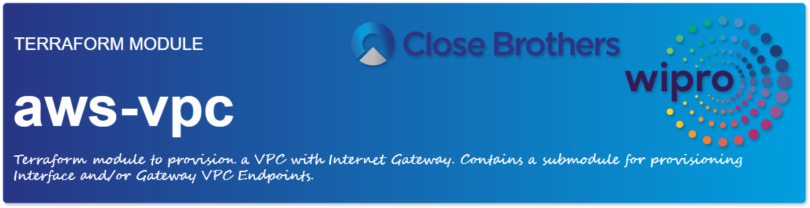

<a href="https://cpco.io/homepage"></a><br/>
# VPC (Virtual Private Cloud) Modules

his module can be used to deploy a pragmatic VPC with various subnets types in # AZs. Common deployment examples can be found in [examples/]

## Usage

```hcl
module "vpc" {
  source = "<modules-PATH>"

  name = "my-vpc"
  cidr = "10.0.0.0/16"

  azs             = ["eu-west-1a", "eu-west-1b", "eu-west-1c"]
  private_subnets = ["10.0.1.0/24", "10.0.2.0/24", "10.0.3.0/24"]
  public_subnets  = ["10.0.101.0/24", "10.0.102.0/24", "10.0.103.0/24"]

  enable_nat_gateway = true
  enable_vpn_gateway = true

  tags = {
    Terraform = "true"
    Environment = "dev"
  }
}
```

## Features


- [X] **default_network_acl:** Manage a default network ACL.
- [X] **default_route_table:** Provides a resource to manage a default route table of a VPC.
- [ ] **default_security_group:** Manage a default security group resource.
- [ ] **default_subnet:** Manage a default subnet resource.
- [X] **default_vpc:** Manage a default VPC resource.
- [ ] **default_vpc_dhcp_options:** Manage the default VPC DHCP Options resource.
- [ ] **ec2_managed_prefix_list:** Provides a managed prefix list resource.
- [ ] **ec2_managed_prefix_list_entry:** Use the `aws_ec2_managed_prefix_list_entry` resource to manage a managed prefix list entry.
- [ ] **ec2_network_insights_analysis:** Provides a Network Insights Analysis resource.
- [ ] **ec2_network_insights_path:** Provides a Network Insights Path resource.
- [ ] **ec2_subnet_cidr_reservation:** Provides a subnet CIDR reservation resource.
- [ ] **ec2_traffic_mirror_filter:** Provides an Traffic mirror filter
- [ ] **ec2_traffic_mirror_filter_rule:** Provides an Traffic mirror filter rule
- [ ] **ec2_traffic_mirror_session:** Provides a Traffic mirror session
- [ ] **ec2_traffic_mirror_target:** Provides a Traffic mirror target
- [X] **egress_only_internet_gateway:** Provides a resource to create an egress-only Internet gateway.
- [X] **flow_log:** Provides a VPC/Subnet/ENI Flow Log
- [X] **internet_gateway:** Provides a resource to create a VPC Internet Gateway.
- [ ] **internet_gateway_attachment:** Provides a resource to create a VPC Internet Gateway Attachment.
- [ ] **main_route_table_association:** Provides a resource for managing the main routing table of a VPC.
- [X] **nat_gateway:** Provides a resource to create a VPC NAT Gateway.
- [X] **network_acl:** Provides an network ACL resource.
- [ ] **network_acl_association:** Provides an network ACL association resource.
- [X] **network_acl_rule:** Provides an network ACL Rule resource.
- [ ] **network_interface:** Provides an Elastic network interface (ENI) resource.
- [ ] **network_interface_attachment:** Attach an Elastic network interface (ENI) resource with EC2 instance.
- [ ] **network_interface_sg_attachment:** Associates a security group with a network interface.
- [X] **route:** Provides a resource to create a routing entry in a VPC routing table.
- [X] **route_table:** Provides a resource to create a VPC routing table.
- [X] **route_table_association:** Provides a resource to create an association between a route table and a subnet or a route table and an internet gateway or virtual private gateway.
- [ ] **security_group:** Provides a security group resource.
- [ ] **security_group_rule:** Provides an security group rule resource.
- [X] **subnet:** Provides an VPC subnet resource.
- [X] **vpc:** Provides a VPC resource.
- [X] **vpc_dhcp_options:** Provides a VPC DHCP Options resource.
- [X] **vpc_dhcp_options_association:** Provides a VPC DHCP Options Association resource.
- [ ] **vpc_endpoint:** Provides a VPC Endpoint resource.
- [ ] **vpc_endpoint_connection_accepter:** Provides a resource to accept a pending VPC Endpoint accept request to VPC Endpoint Service.
- [ ] **vpc_endpoint_connection_notification:** Provides a VPC Endpoint connection notification resource.
- [ ] **vpc_endpoint_policy:** Provides a VPC Endpoint Policy resource.
- [ ] **vpc_endpoint_private_dns:** Terraform resource for enabling private DNS on an AWS VPC (Virtual Private Cloud) Endpoint.
- [ ] **vpc_endpoint_route_table_association:** Manages a VPC Endpoint Route Table Association
- [ ] **vpc_endpoint_security_group_association:** Provides a resource to create an association between a VPC endpoint and a security group.
- [ ] **vpc_endpoint_service:** Provides a VPC Endpoint Service resource.
- [ ] **vpc_endpoint_service_allowed_principal:** Provides a resource to allow a principal to discover a VPC endpoint service.
- [ ] **vpc_endpoint_service_private_dns_verification:** Terraform resource for managing an AWS VPC (Virtual Private Cloud) Endpoint Service Private DNS Verification.
- [ ] **vpc_endpoint_subnet_association:** Provides a resource to create an association between a VPC endpoint and a subnet.
- [X] **vpc_ipv4_cidr_block_association:** Associate additional IPv4 CIDR blocks with a VPC
- [ ] **vpc_ipv6_cidr_block_association:** Associate additional IPv6 CIDR blocks with a VPC
- [ ] **vpc_network_performance_metric_subscription:** Provides a resource to manage an Infrastructure Performance subscription.
- [ ] **vpc_peering_connection:** Provides a resource to manage a VPC peering connection.
- [ ] **vpc_peering_connection_accepter:** Manage the accepter's side of a VPC Peering Connection.
- [ ] **vpc_peering_connection_options:** Provides a resource to manage VPC peering connection options.
- [ ] **vpc_security_group_egress_rule:** Provides a VPC security group egress rule resource.
- [ ] **vpc_security_group_ingress_rule:** Provides a VPC security group ingress rule resource.
- [ ] **vpc_security_group_vpc_association:** Terraform resource for managing Security Group VPC Associations.


## Requirements

| Name | Version |
|------|---------|
| <a name="requirement_terraform"></a> [terraform](#requirement\_terraform) | >= 1.0 |
| <a name="requirement_aws"></a> [aws](#requirement\_aws) | >= 5.46 |

## Providers

| Name | Version |
|------|---------|
| <a name="provider_aws"></a> [aws](#provider\_aws) | >= 5.46 |

## Components

## Modules

No modules.

## Components

### Data Sources
- `aws_caller_identity.current`
- `aws_iam_policy_document.flow_log_cloudwatch_assume_role`
- `aws_iam_policy_document.vpc_flow_log_cloudwatch`
- `aws_partition.current`
- `aws_region.current`

### Resources
- `aws_cloudwatch_log_group.flow_log`
- `aws_db_subnet_group.database`
- `aws_default_network_acl.this`
- `aws_default_route_table.default`
- `aws_default_security_group.this`
- `aws_default_vpc.this`
- `aws_egress_only_internet_gateway.this`
- `aws_eip.nat`
- `aws_flow_log.this`
- `aws_iam_policy.vpc_flow_log_cloudwatch`
- `aws_iam_role.vpc_flow_log_cloudwatch`
- `aws_iam_role_policy_attachment.vpc_flow_log_cloudwatch`
- `aws_internet_gateway.this`
- `aws_nat_gateway.this`
- `aws_network_acl.database`
- `aws_network_acl.private`
- `aws_network_acl.public`
- `aws_network_acl_rule.database_inbound`
- `aws_network_acl_rule.database_outbound`
- `aws_network_acl_rule.private_inbound`
- `aws_network_acl_rule.private_outbound`
- `aws_network_acl_rule.public_inbound`
- `aws_network_acl_rule.public_outbound`
- `aws_route.database_dns64_nat_gateway`
- `aws_route.database_internet_gateway`
- `aws_route.database_ipv6_egress`
- `aws_route.database_nat_gateway`
- `aws_route.private_dns64_nat_gateway`
- `aws_route.private_ipv6_egress`
- `aws_route.private_nat_gateway`
- `aws_route.public_internet_gateway`
- `aws_route.public_internet_gateway_ipv6`
- `aws_route_table.database`
- `aws_route_table.private`
- `aws_route_table.public`
- `aws_route_table_association.database`
- `aws_route_table_association.private`
- `aws_route_table_association.public`
- `aws_subnet.database`
- `aws_subnet.private`
- `aws_subnet.public`
- `aws_vpc.this`
- `aws_vpc_dhcp_options.this`
- `aws_vpc_dhcp_options_association.this`

### Local Variables
- `create_database_network_acl`
- `create_database_route_table`
- `create_database_subnets`
- `create_flow_log_cloudwatch_iam_role`
- `create_flow_log_cloudwatch_log_group`
- `create_private_network_acl`
- `create_private_subnets`
- `create_public_subnets`
- `enable_flow_log`
- `flow_log_cloudwatch_log_group_name_suffix`
- `flow_log_destination_arn`
- `flow_log_group_arns`
- `flow_log_iam_role_arn`
- `len_database_subnets`
- `len_private_subnets`
- `len_public_subnets`
- `max_subnet_length`
- `nat_gateway_count`
- `nat_gateway_ips`
- `num_public_route_tables`
- `private_route_table_ids`
- `public_route_table_ids`
- `vpc_id`


### Variables

| Variable | Description | Type | Default | Required |
|----------|-------------|------|---------|----------|
| `region` | The region where to deploy this code (e.g. us-east-1). | map(string) | "us-east-1" | No |
| `environment` | Environment for service | map(string) | "STAGE" | No |
| `default_tags` | A map of default tags to apply to all resources. | map(string) | <pre>{<br/>    Environment   = "default"<br/>    Orchestration = "Terraform"<br/>  }<br/></pre> | No |
| `tags` | A list of tag blocks. Each element should have keys named key, value, and propagate_at_launch. | map(string) | {} | No |
| `azs` | A list of availability zones names or ids in the region | list(string) | [] | No |
| `cidr` | (Optional) The IPv4 CIDR block for the VPC. CIDR can be explicitly set or it can be derived from IPAM using `ipv4_netmask_length` & `ipv4_ipam_pool_id` | string | "10.0.0.0/16" | No |
| `create_database_internet_gateway_route` | Controls if an internet gateway route for public database access should be created | bool | false | No |
| `create_database_nat_gateway_route` | Controls if a nat gateway route should be created to give internet access to the database subnets | bool | false | No |
| `create_database_subnet_group` | Controls if database subnet group should be created (n.b. database_subnets must also be set) | bool | true | No |
| `create_database_subnet_route_table` | Controls if separate route table for database should be created | bool | false | No |
| `create_egress_only_igw` | Controls if an Egress Only Internet Gateway is created and its related routes | bool | true | No |
| `create_flow_log_cloudwatch_iam_role` | Whether to create IAM role for VPC Flow Logs | bool | false | No |
| `create_flow_log_cloudwatch_log_group` | Whether to create CloudWatch log group for VPC Flow Logs | bool | false | No |
| `create_igw` | Controls if an Internet Gateway is created for public subnets and the related routes that connect them | bool | true | No |
| `create_multiple_public_route_tables` | Indicates whether to create a separate route table for each public subnet. Default: `false` | bool | false | No |
| `create_private_nat_gateway_route` | Controls if a nat gateway route should be created to give internet access to the private subnets | bool | true | No |
| `create_vpc` | Controls if VPC should be created (it affects almost all resources) | bool | true | No |
| `database_acl_tags` | Additional tags for the database subnets network ACL | map(string) | {} | No |
| `database_dedicated_network_acl` | Whether to use dedicated network ACL (not default) and custom rules for database subnets | bool | false | No |
| `database_inbound_acl_rules` | Database subnets inbound network ACL rules | list(map(string)) | <pre>[<br/>    {<br/>      rule_number = 100<br/>      rule_action = "allow"<br/>      from_port   = 0<br/>      to_port     = 0<br/>      protocol    = "-1"<br/>      cidr_block  = "0.0.0.0/0"<br/>    },<br/>  ]<br/></pre> | No |
| `database_outbound_acl_rules` | Database subnets outbound network ACL rules | list(map(string)) | <pre>[<br/>    {<br/>      rule_number = 100<br/>      rule_action = "allow"<br/>      from_port   = 0<br/>      to_port     = 0<br/>      protocol    = "-1"<br/>      cidr_block  = "0.0.0.0/0"<br/>    },<br/>  ]<br/></pre> | No |
| `database_route_table_tags` | Additional tags for the database route tables | map(string) | {} | No |
| `database_subnet_assign_ipv6_address_on_creation` | Specify true to indicate that network interfaces created in the specified subnet should be assigned an IPv6 address. Default is `false` | bool | false | No |
| `database_subnet_enable_dns64` | Indicates whether DNS queries made to the Amazon-provided DNS Resolver in this subnet should return synthetic IPv6 addresses for IPv4-only destinations. Default: `true` | bool | true | No |
| `database_subnet_enable_resource_name_dns_a_record_on_launch` | Indicates whether to respond to DNS queries for instance hostnames with DNS A records. Default: `false` | bool | false | No |
| `database_subnet_enable_resource_name_dns_aaaa_record_on_launch` | Indicates whether to respond to DNS queries for instance hostnames with DNS AAAA records. Default: `true` | bool | true | No |
| `database_subnet_group_name` | Name of database subnet group | string | {} | No |
| `database_subnet_group_tags` | Additional tags for the database subnet group | map(string) | {} | No |
| `database_subnet_ipv6_native` | Indicates whether to create an IPv6-only subnet. Default: `false` | bool | false | No |
| `database_subnet_ipv6_prefixes` | Assigns IPv6 database subnet id based on the Amazon provided /56 prefix base 10 integer (0-256). Must be of equal length to the corresponding IPv4 subnet list | list(string) | [] | No |
| `database_subnet_names` | Explicit values to use in the Name tag on database subnets. If empty, Name tags are generated | list(string) | [] | No |
| `database_subnet_private_dns_hostname_type_on_launch` | The type of hostnames to assign to instances in the subnet at launch. For IPv6-only subnets, an instance DNS name must be based on the instance ID. For dual-stack and IPv4-only subnets, you can specify whether DNS names use the instance IPv4 address or the instance ID. Valid values: `ip-name`, `resource-name` | string | "db" | No |
| `database_subnet_suffix` | Suffix to append to database subnets name | string | "db" | No |
| `database_subnet_tags` | Additional tags for the database subnets | map(string) | {} | No |
| `database_subnets` | A list of database subnets inside the VPC | list(string) | [] | No |
| `default_network_acl_egress` | List of maps of egress rules to set on the Default Network ACL | list(map(string)) | <pre>[<br/>    {<br/>      rule_no    = 100<br/>      action     = "allow"<br/>      from_port  = 0<br/>      to_port    = 0<br/>      protocol   = "-1"<br/>      cidr_block = "0.0.0.0/0"<br/>    },<br/>    {<br/>      rule_no         = 101<br/>      action          = "allow"<br/>      from_port       = 0<br/>      to_port         = 0<br/>      protocol        = "-1"<br/>      ipv6_cidr_block = "::/0"<br/>    },<br/>  ]<br/></pre> | No |
| `default_network_acl_ingress` | List of maps of ingress rules to set on the Default Network ACL | list(map(string)) | <pre>[<br/>    {<br/>      rule_no    = 100<br/>      action     = "allow"<br/>      from_port  = 0<br/>      to_port    = 0<br/>      protocol   = "-1"<br/>      cidr_block = "0.0.0.0/0"<br/>    },<br/>    {<br/>      rule_no         = 101<br/>      action          = "allow"<br/>      from_port       = 0<br/>      to_port         = 0<br/>      protocol        = "-1"<br/>      ipv6_cidr_block = "::/0"<br/>    },<br/>  ]<br/></pre> | No |
| `default_network_acl_name` | Name to be used on the Default Network ACL | string | {} | No |
| `default_network_acl_tags` | Additional tags for the Default Network ACL | map(string) | {} | No |
| `default_route_table_name` | Name to be used on the default route table | string | [] | No |
| `default_route_table_propagating_vgws` | List of virtual gateways for propagation | list(string) | [] | No |
| `default_route_table_routes` | Configuration block of routes. See https://registry.terraform.io/providers/hashicorp/aws/latest/docs/resources/default_route_table#route | list(map(string)) | [] | No |
| `default_route_table_tags` | Additional tags for the default route table | map(string) | {} | No |
| `default_security_group_egress` | List of maps of egress rules to set on the default security group | list(map(string)) | [] | No |
| `default_security_group_ingress` | List of maps of ingress rules to set on the default security group | list(map(string)) | [] | No |
| `default_security_group_name` | Name to be used on the default security group | string | {} | No |
| `default_security_group_tags` | Additional tags for the default security group | map(string) | {} | No |
| `default_vpc_enable_dns_hostnames` | Should be true to enable DNS hostnames in the Default VPC | bool | true | No |
| `default_vpc_enable_dns_support` | Should be true to enable DNS support in the Default VPC | bool | true | No |
| `default_vpc_name` | Name to be used on the Default VPC | string | {} | No |
| `default_vpc_tags` | Additional tags for the Default VPC | map(string) | {} | No |
| `dhcp_options_domain_name` | Specifies DNS name for DHCP options set (requires enable_dhcp_options set to true) | string | "" | No |
| `dhcp_options_domain_name_servers` | Specify a list of DNS server addresses for DHCP options set, default to AWS provided (requires enable_dhcp_options set to true) | list(string) | ["AmazonProvidedDNS"] | No |
| `dhcp_options_ipv6_address_preferred_lease_time` | How frequently, in seconds, a running instance with an IPv6 assigned to it goes through DHCPv6 lease renewal (requires enable_dhcp_options set to true) | number | [] | No |
| `dhcp_options_netbios_name_servers` | Specify a list of netbios servers for DHCP options set (requires enable_dhcp_options set to true) | list(string) | [] | No |
| `dhcp_options_netbios_node_type` | Specify netbios node_type for DHCP options set (requires enable_dhcp_options set to true) | string | "" | No |
| `dhcp_options_ntp_servers` | Specify a list of NTP servers for DHCP options set (requires enable_dhcp_options set to true) | list(string) | [] | No |
| `dhcp_options_tags` | Additional tags for the DHCP option set (requires enable_dhcp_options set to true) | map(string) | {} | No |
| `enable_dhcp_options` | Should be true if you want to specify a DHCP options set with a custom domain name, DNS servers, NTP servers, netbios servers, and/or netbios server type | bool | false | No |
| `enable_dns_hostnames` | Should be true to enable DNS hostnames in the VPC | bool | true | No |
| `enable_dns_support` | Should be true to enable DNS support in the VPC | bool | true | No |
| `enable_flow_log` | Whether or not to enable VPC Flow Logs | bool | false | No |
| `enable_ipv6` | Requests an Amazon-provided IPv6 CIDR block with a /56 prefix length for the VPC. You cannot specify the range of IP addresses, or the size of the CIDR block | bool | false | No |
| `enable_nat_gateway` | Should be true if you want to provision NAT Gateways for each of your private networks | bool | false | No |
| `enable_network_address_usage_metrics` | Determines whether network address usage metrics are enabled for the VPC | bool | [] | No |
| `external_nat_ip_ids` | List of EIP IDs to be assigned to the NAT Gateways (used in combination with reuse_nat_ips) | list(string) | [] | No |
| `flow_log_cloudwatch_iam_role_arn` | The ARN for the IAM role that's used to post flow logs to a CloudWatch Logs log group. When flow_log_destination_arn is set to ARN of Cloudwatch Logs, this argument needs to be provided | string | "" | No |
| `flow_log_cloudwatch_log_group_class` | Specified the log class of the log group. Possible values are: STANDARD or INFREQUENT_ACCESS | string | "/aws/vpc-flow-log/" | No |
| `flow_log_cloudwatch_log_group_kms_key_id` | The ARN of the KMS Key to use when encrypting log data for VPC flow logs | string | "/aws/vpc-flow-log/" | No |
| `flow_log_cloudwatch_log_group_name_prefix` | Specifies the name prefix of CloudWatch Log Group for VPC flow logs | string | "/aws/vpc-flow-log/" | No |
| `flow_log_cloudwatch_log_group_name_suffix` | Specifies the name suffix of CloudWatch Log Group for VPC flow logs | string | "" | No |
| `flow_log_cloudwatch_log_group_retention_in_days` | Specifies the number of days you want to retain log events in the specified log group for VPC flow logs | number | false | No |
| `flow_log_cloudwatch_log_group_skip_destroy` | Set to true if you do not wish the log group (and any logs it may contain) to be deleted at destroy time, and instead just remove the log group from the Terraform state | bool | false | No |
| `flow_log_deliver_cross_account_role` | (Optional) ARN of the IAM role that allows Amazon EC2 to publish flow logs across accounts. | string | "" | No |
| `flow_log_destination_arn` | The ARN of the CloudWatch log group or S3 bucket where VPC Flow Logs will be pushed. If this ARN is a S3 bucket the appropriate permissions need to be set on that bucket's policy. When create_flow_log_cloudwatch_log_group is set to false this argument must be provided | string | "" | No |
| `flow_log_destination_type` | Type of flow log destination. Can be s3, kinesis-data-firehose or cloud-watch-logs | string | "cloud-watch-logs" | No |
| `flow_log_file_format` | (Optional) The format for the flow log. Valid values: `plain-text`, `parquet` | string | false | No |
| `flow_log_hive_compatible_partitions` | (Optional) Indicates whether to use Hive-compatible prefixes for flow logs stored in Amazon S3 | bool | false | No |
| `flow_log_log_format` | The fields to include in the flow log record, in the order in which they should appear | string | 600 | No |
| `flow_log_max_aggregation_interval` | The maximum interval of time during which a flow of packets is captured and aggregated into a flow log record. Valid Values: `60` seconds or `600` seconds | number | 600 | No |
| `flow_log_per_hour_partition` | (Optional) Indicates whether to partition the flow log per hour. This reduces the cost and response time for queries | bool | false | No |
| `flow_log_traffic_type` | The type of traffic to capture. Valid values: ACCEPT, REJECT, ALL | string | "ALL" | No |
| `igw_tags` | Additional tags for the internet gateway | map(string) | {} | No |
| `instance_tenancy` | A tenancy option for instances launched into the VPC | string | "default" | No |
| `ipv4_ipam_pool_id` | (Optional) The ID of an IPv4 IPAM pool you want to use for allocating this VPC's CIDR | string | true | No |
| `ipv4_netmask_length` | (Optional) The netmask length of the IPv4 CIDR you want to allocate to this VPC. Requires specifying a ipv4_ipam_pool_id | number | true | No |
| `ipv6_cidr` | (Optional) IPv6 CIDR block to request from an IPAM Pool. Can be set explicitly or derived from IPAM using `ipv6_netmask_length` | string | true | No |
| `ipv6_cidr_block_network_border_group` | By default when an IPv6 CIDR is assigned to a VPC a default ipv6_cidr_block_network_border_group will be set to the region of the VPC. This can be changed to restrict advertisement of public addresses to specific Network Border Groups such as LocalZones | string | true | No |
| `ipv6_ipam_pool_id` | (Optional) IPAM Pool ID for a IPv6 pool. Conflicts with `assign_generated_ipv6_cidr_block` | string | true | No |
| `ipv6_netmask_length` | (Optional) Netmask length to request from IPAM Pool. Conflicts with `ipv6_cidr_block`. This can be omitted if IPAM pool as a `allocation_default_netmask_length` set. Valid values: `56` | number | true | No |
| `manage_default_network_acl` | Should be true to adopt and manage Default Network ACL | bool | true | No |
| `manage_default_route_table` | Should be true to manage default route table | bool | true | No |
| `manage_default_security_group` | Should be true to adopt and manage default security group | bool | true | No |
| `manage_default_vpc` | Should be true to adopt and manage Default VPC | bool | false | No |
| `map_public_ip_on_launch` | Specify true to indicate that instances launched into the subnet should be assigned a public IP address. Default is `false` | bool | false | No |
| `name` | Name to be used on all the resources as identifier | string | "" | No |
| `nat_eip_tags` | Additional tags for the NAT EIP | map(string) | {} | No |
| `nat_gateway_destination_cidr_block` | Used to pass a custom destination route for private NAT Gateway. If not specified, the default 0.0.0.0/0 is used as a destination route | string | "0.0.0.0/0" | No |
| `nat_gateway_tags` | Additional tags for the NAT gateways | map(string) | {} | No |
| `one_nat_gateway_per_az` | Should be true if you want only one NAT Gateway per availability zone. Requires `var.azs` to be set, and the number of `public_subnets` created to be greater than or equal to the number of availability zones specified in `var.azs` | bool | false | No |
| `private_acl_tags` | Additional tags for the private subnets network ACL | map(string) | {} | No |
| `private_dedicated_network_acl` | Whether to use dedicated network ACL (not default) and custom rules for private subnets | bool | false | No |
| `private_inbound_acl_rules` | Private subnets inbound network ACLs | list(map(string)) | <pre>[<br/>    {<br/>      rule_number = 100<br/>      rule_action = "allow"<br/>      from_port   = 0<br/>      to_port     = 0<br/>      protocol    = "-1"<br/>      cidr_block  = "0.0.0.0/0"<br/>    },<br/>  ]<br/></pre> | No |
| `private_outbound_acl_rules` | Private subnets outbound network ACLs | list(map(string)) | <pre>[<br/>    {<br/>      rule_number = 100<br/>      rule_action = "allow"<br/>      from_port   = 0<br/>      to_port     = 0<br/>      protocol    = "-1"<br/>      cidr_block  = "0.0.0.0/0"<br/>    },<br/>  ]<br/></pre> | No |
| `private_route_table_tags` | Additional tags for the private route tables | map(string) | {} | No |
| `private_subnet_assign_ipv6_address_on_creation` | Specify true to indicate that network interfaces created in the specified subnet should be assigned an IPv6 address. Default is `false` | bool | false | No |
| `private_subnet_enable_dns64` | Indicates whether DNS queries made to the Amazon-provided DNS Resolver in this subnet should return synthetic IPv6 addresses for IPv4-only destinations. Default: `true` | bool | true | No |
| `private_subnet_enable_resource_name_dns_a_record_on_launch` | Indicates whether to respond to DNS queries for instance hostnames with DNS A records. Default: `false` | bool | false | No |
| `private_subnet_enable_resource_name_dns_aaaa_record_on_launch` | Indicates whether to respond to DNS queries for instance hostnames with DNS AAAA records. Default: `true` | bool | true | No |
| `private_subnet_ipv6_native` | Indicates whether to create an IPv6-only subnet. Default: `false` | bool | false | No |
| `private_subnet_ipv6_prefixes` | Assigns IPv6 private subnet id based on the Amazon provided /56 prefix base 10 integer (0-256). Must be of equal length to the corresponding IPv4 subnet list | list(string) | [] | No |
| `private_subnet_names` | Explicit values to use in the Name tag on private subnets. If empty, Name tags are generated | list(string) | [] | No |
| `private_subnet_private_dns_hostname_type_on_launch` | The type of hostnames to assign to instances in the subnet at launch. For IPv6-only subnets, an instance DNS name must be based on the instance ID. For dual-stack and IPv4-only subnets, you can specify whether DNS names use the instance IPv4 address or the instance ID. Valid values: `ip-name`, `resource-name` | string | "private" | No |
| `private_subnet_suffix` | Suffix to append to private subnets name | string | "private" | No |
| `private_subnet_tags` | Additional tags for the private subnets | map(string) | {} | No |
| `private_subnet_tags_per_az` | Additional tags for the private subnets where the primary key is the AZ | map(map(string)) | {} | No |
| `private_subnets` | A list of private subnets inside the VPC | list(string) | [] | No |
| `public_acl_tags` | Additional tags for the public subnets network ACL | map(string) | {} | No |
| `public_dedicated_network_acl` | Whether to use dedicated network ACL (not default) and custom rules for public subnets | bool | false | No |
| `public_inbound_acl_rules` | Public subnets inbound network ACLs | list(map(string)) | <pre>[<br/>    {<br/>      rule_number = 100<br/>      rule_action = "allow"<br/>      from_port   = 0<br/>      to_port     = 0<br/>      protocol    = "-1"<br/>      cidr_block  = "0.0.0.0/0"<br/>    },<br/>  ]<br/></pre> | No |
| `public_outbound_acl_rules` | Public subnets outbound network ACLs | list(map(string)) | <pre>[<br/>    {<br/>      rule_number = 100<br/>      rule_action = "allow"<br/>      from_port   = 0<br/>      to_port     = 0<br/>      protocol    = "-1"<br/>      cidr_block  = "0.0.0.0/0"<br/>    },<br/>  ]<br/></pre> | No |
| `public_route_table_tags` | Additional tags for the public route tables | map(string) | {} | No |
| `public_subnet_assign_ipv6_address_on_creation` | Specify true to indicate that network interfaces created in the specified subnet should be assigned an IPv6 address. Default is `false` | bool | false | No |
| `public_subnet_enable_dns64` | Indicates whether DNS queries made to the Amazon-provided DNS Resolver in this subnet should return synthetic IPv6 addresses for IPv4-only destinations. Default: `true` | bool | true | No |
| `public_subnet_enable_resource_name_dns_a_record_on_launch` | Indicates whether to respond to DNS queries for instance hostnames with DNS A records. Default: `false` | bool | false | No |
| `public_subnet_enable_resource_name_dns_aaaa_record_on_launch` | Indicates whether to respond to DNS queries for instance hostnames with DNS AAAA records. Default: `true` | bool | true | No |
| `public_subnet_ipv6_native` | Indicates whether to create an IPv6-only subnet. Default: `false` | bool | false | No |
| `public_subnet_ipv6_prefixes` | Assigns IPv6 public subnet id based on the Amazon provided /56 prefix base 10 integer (0-256). Must be of equal length to the corresponding IPv4 subnet list | list(string) | [] | No |
| `public_subnet_names` | Explicit values to use in the Name tag on public subnets. If empty, Name tags are generated | list(string) | [] | No |
| `public_subnet_private_dns_hostname_type_on_launch` | The type of hostnames to assign to instances in the subnet at launch. For IPv6-only subnets, an instance DNS name must be based on the instance ID. For dual-stack and IPv4-only subnets, you can specify whether DNS names use the instance IPv4 address or the instance ID. Valid values: `ip-name`, `resource-name` | string | "public" | No |
| `public_subnet_suffix` | Suffix to append to public subnets name | string | "public" | No |
| `public_subnet_tags` | Additional tags for the public subnets | map(string) | {} | No |
| `public_subnet_tags_per_az` | Additional tags for the public subnets where the primary key is the AZ | map(map(string)) | {} | No |
| `public_subnets` | A list of public subnets inside the VPC | list(string) | [] | No |
| `reuse_nat_ips` | Should be true if you don't want EIPs to be created for your NAT Gateways and will instead pass them in via the 'external_nat_ip_ids' variable | bool | false | No |
| `single_nat_gateway` | Should be true if you want to provision a single shared NAT Gateway across all of your private networks | bool | false | No |
| `use_ipam_pool` | Determines whether IPAM pool is used for CIDR allocation | bool | false | No |
| `vpc_flow_log_iam_policy_name` | Name of the IAM policy | string | "vpc-flow-log-to-cloudwatch" | No |
| `vpc_flow_log_iam_policy_use_name_prefix` | Determines whether the name of the IAM policy (`vpc_flow_log_iam_policy_name`) is used as a prefix | bool | true | No |
| `vpc_flow_log_iam_role_name` | Name to use on the VPC Flow Log IAM role created | string | "vpc-flow-log-role" | No |
| `vpc_flow_log_iam_role_use_name_prefix` | Determines whether the IAM role name (`vpc_flow_log_iam_role_name_name`) is used as a prefix | bool | true | No |
| `vpc_flow_log_permissions_boundary` | The ARN of the Permissions Boundary for the VPC Flow Log IAM Role | string | {} | No |
| `vpc_flow_log_tags` | Additional tags for the VPC Flow Logs | map(string) | {} | No |
| `vpc_tags` | Additional tags for the VPC | map(string) | {} | No |
| `external_nat_ips` | List of EIPs to be used for `nat_public_ips` output (used in combination with reuse_nat_ips and external_nat_ip_ids) | list(string) | [] | No |

## Outputs

| Output | Description |
|--------|-------------|
| `vpc_id` | The ID of the VPC |
| `vpc_arn` | The ARN of the VPC |
| `vpc_cidr_block` | The CIDR block of the VPC |
| `default_security_group_id` | The ID of the security group created by default on VPC creation |
| `default_network_acl_id` | The ID of the default network ACL |
| `default_route_table_id` | The ID of the default route table |
| `vpc_instance_tenancy` | Tenancy of instances spin up within VPC |
| `vpc_enable_dns_support` | Whether or not the VPC has DNS support |
| `vpc_enable_dns_hostnames` | Whether or not the VPC has DNS hostname support |
| `vpc_main_route_table_id` | The ID of the main route table associated with this VPC |
| `vpc_ipv6_association_id` | The association ID for the IPv6 CIDR block |
| `vpc_ipv6_cidr_block` | The IPv6 CIDR block |
| `vpc_secondary_cidr_blocks` | List of secondary CIDR blocks of the VPC |
| `vpc_owner_id` | The ID of the AWS account that owns the VPC |
| `dhcp_options_id` | The ID of the DHCP options |
| `igw_id` | The ID of the Internet Gateway |
| `igw_arn` | The ARN of the Internet Gateway |
| `public_subnet_objects` | A list of all public subnets, containing the full objects. |
| `public_subnets` | List of IDs of public subnets |
| `public_subnet_arns` | List of ARNs of public subnets |
| `public_subnets_cidr_blocks` | List of cidr_blocks of public subnets |
| `public_subnets_ipv6_cidr_blocks` | List of IPv6 cidr_blocks of public subnets in an IPv6 enabled VPC |
| `public_route_table_ids` | List of IDs of public route tables |
| `public_internet_gateway_route_id` | ID of the internet gateway route |
| `public_internet_gateway_ipv6_route_id` | ID of the IPv6 internet gateway route |
| `public_route_table_association_ids` | List of IDs of the public route table association |
| `public_network_acl_id` | ID of the public network ACL |
| `public_network_acl_arn` | ARN of the public network ACL |
| `private_subnet_objects` | A list of all private subnets, containing the full objects. |
| `private_subnets` | List of IDs of private subnets |
| `private_subnet_arns` | List of ARNs of private subnets |
| `private_subnets_cidr_blocks` | List of cidr_blocks of private subnets |
| `private_subnets_ipv6_cidr_blocks` | List of IPv6 cidr_blocks of private subnets in an IPv6 enabled VPC |
| `private_route_table_ids` | List of IDs of private route tables |
| `private_nat_gateway_route_ids` | List of IDs of the private nat gateway route |
| `private_ipv6_egress_route_ids` | List of IDs of the ipv6 egress route |
| `private_route_table_association_ids` | List of IDs of the private route table association |
| `private_network_acl_id` | ID of the private network ACL |
| `private_network_acl_arn` | ARN of the private network ACL |
| `database_subnet_objects` | A list of all database subnets, containing the full objects. |
| `database_subnets` | List of IDs of database subnets |
| `database_subnet_arns` | List of ARNs of database subnets |
| `database_subnets_cidr_blocks` | List of cidr_blocks of database subnets |
| `database_subnets_ipv6_cidr_blocks` | List of IPv6 cidr_blocks of database subnets in an IPv6 enabled VPC |
| `database_subnet_group` | ID of database subnet group |
| `database_subnet_group_name` | Name of database subnet group |
| `database_route_table_ids` | List of IDs of database route tables |
| `database_internet_gateway_route_id` | ID of the database internet gateway route |
| `database_nat_gateway_route_ids` | List of IDs of the database nat gateway route |
| `database_ipv6_egress_route_id` | ID of the database IPv6 egress route |
| `database_route_table_association_ids` | List of IDs of the database route table association |
| `database_network_acl_id` | ID of the database network ACL |
| `database_network_acl_arn` | ARN of the database network ACL |
| `nat_ids` | List of allocation ID of Elastic IPs created for AWS NAT Gateway |
| `nat_public_ips` | List of public Elastic IPs created for AWS NAT Gateway |
| `natgw_ids` | List of NAT Gateway IDs |
| `natgw_interface_ids` | List of Network Interface IDs assigned to NAT Gateways |
| `egress_only_internet_gateway_id` | The ID of the egress only Internet Gateway |
| `default_vpc_id` | The ID of the Default VPC |
| `default_vpc_arn` | The ARN of the Default VPC |
| `default_vpc_cidr_block` | The CIDR block of the Default VPC |
| `default_vpc_default_security_group_id` | The ID of the security group created by default on Default VPC creation |
| `default_vpc_default_network_acl_id` | The ID of the default network ACL of the Default VPC |
| `default_vpc_default_route_table_id` | The ID of the default route table of the Default VPC |
| `default_vpc_instance_tenancy` | Tenancy of instances spin up within Default VPC |
| `default_vpc_enable_dns_support` | Whether or not the Default VPC has DNS support |
| `default_vpc_enable_dns_hostnames` | Whether or not the Default VPC has DNS hostname support |
| `default_vpc_main_route_table_id` | The ID of the main route table associated with the Default VPC |
| `vpc_flow_log_id` | The ID of the Flow Log resource |
| `vpc_flow_log_destination_arn` | The ARN of the destination for VPC Flow Logs |
| `vpc_flow_log_destination_type` | The type of the destination for VPC Flow Logs |
| `vpc_flow_log_cloudwatch_iam_role_arn` | The ARN of the IAM role used when pushing logs to Cloudwatch log group |
| `vpc_flow_log_deliver_cross_account_role` | The ARN of the IAM role used when pushing logs cross account |
| `azs` | A list of availability zones specified as argument to this module |
| `name` | The name of the VPC specified as argument to this module |
